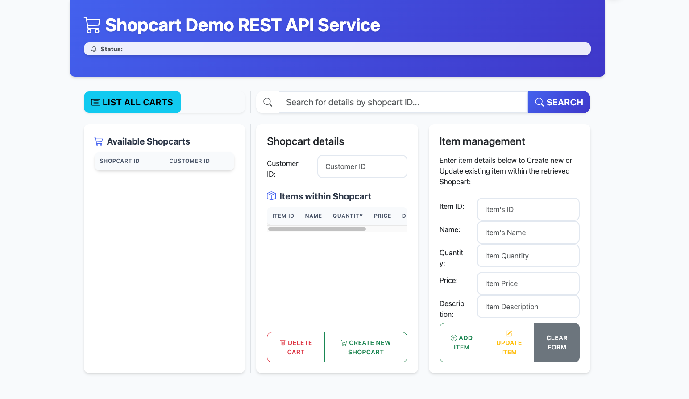

<style>
:root {
  --text-color: #333;
  --accent-color: #0f62fe;
  --bg-light: #f7f9fa;
}

body {
  font-family: -apple-system, BlinkMacSystemFont, "Segoe UI", Roboto, Helvetica, Arial, sans-serif;
  color: var(--text-color);
  line-height: 1.6;
}

h1, h2, h3, h4 {
  color: var(--accent-color);
  font-weight: 600;
  margin-top: 2.5rem;
  margin-bottom: 1rem;
}

/* Icon prefixes for headings */
h1::before {
  content: '🛒 ';
}
h2::before {
  content: '📄 ';
}
h3::before {
  content: '📁 ';
}
h4::before {
  content: '🔹 ';
}

hr {
  border: none;
  border-top: 1px solid #e1e4e8;
  margin: 2.5rem 0;
}

table {
  border-collapse: collapse;
  width: 100%;
}

table th, table td {
  border: 1px solid #d0d7de;
  padding: 0.75rem 1rem;
  text-align: left;
}

table thead {
  background-color: var(--bg-light);
}

code {
  background: var(--bg-light);
  padding: 0.15rem 0.35rem;
  border-radius: 4px;
  font-size: 0.95em;
}

pre {
  background: var(--bg-light);
  padding: 1.25rem;
  border-radius: 6px;
  overflow-x: auto;
}
</style>


[](https://github.com/emjduff/lab-github-actions/actions)
[](https://codecov.io/gh/emjduff/lab-github-actions)

# NYU DevOps Project - Shopcarts

[](https://opensource.org/licenses/Apache-2.0)
[](https://python.org/)


---

## Overview and Template Description

This project template contains starter code for your class project. The `/service` folder holds your `models.py` file for the model and a `routes.py` file for the service. The `/tests` folder has test‑case starter code for testing the model and the service separately. All you need to do is add your functionality. You can use the [lab-flask-tdd](https://github.com/nyu-devops/lab-flask-tdd) for code examples to copy from.

The **Shopcarts** service allows customers to build a collection of products they want to purchase. At a minimum, each cart stores:

* a reference to the product ID
* a description
* the quantity to buy

Optionally, it may also record the price at the time of adding to cart. A customer has only one shopcart, so you need a subordinate REST API to manipulate cart items (e.g. `/shopcarts/{id}/items/{id}`) and associate the cart with the customer, preferably via `customer_id`.

<p align="center">
  
</p>

---

## Contents

```text
service/                   - service python package
├── __init__.py            - package initializer
├── config.py              - configuration parameters
├── models/                - module containing data models
│   ├── __init__.py        - models package initializer
│   ├── persistent_base.py - base class for database models
│   ├── shopcart.py        - model for Shopcarts
│   └── item.py            - model for Items within a Shopcart
├── routes.py              - module with service routes
├── static/                - folder for static web assets (HTML, CSS, JS)
│   ├── css/               - CSS stylesheets
│   └── js/                - JavaScript files
└── common                 - common code package
    ├── __init__.py        - common package initializer
    ├── cli_commands.py    - Flask command to recreate all tables
    ├── error_handlers.py  - HTTP error handling code
    ├── log_handlers.py    - logging setup code
    └── status.py          - HTTP status constants

tests/                     - test cases package
├── __init__.py            - package initializer
├── factories.py           - Factory for testing with fake objects
├── test_cli_commands.py   - test suite for the CLI
├── test_item.py           - test suite for the Item model
├── test_shopcart.py       - test suite for the Shopcart model
└── test_routes.py         - test suite for service routes

features/                  - BDD test features package (incl. features file)
├── environment.py         - BDD environment setup
└── steps/                 - BDD step definitions
    ├── shopcart_steps.py  - Step definitions for setting up shopcarts/items
    └── web_steps.py       - Step definitions for web UI interactions

k8s/                       - Kubernetes manifest files
├── deployment.yaml        - Kubernetes Deployment definition
├── ingress.yaml           - Kubernetes Ingress definition
├── postgres.yaml          - Kubernetes StatefulSet, PVC, Service for PostgreSQL
├── pv.yaml                - Kubernetes PersistentVolume definition (for local dev)
├── secret.yaml            - Kubernetes Secret definition
└── service.yaml           - Kubernetes Service definition
```

---

## Database Models

> Data is stored in PostgreSQL. Models live in `service/models/`.

### `shopcart` (in `shopcart.py`)

* `id`
* `customer_id`
* `time_atc`
* `items`

### `item` (in `item.py`)

* `id`
* `id`
* `name`
* `description`
* `quantity`
* `price`

---

## Functionalities

The following actions are available when interacting with the Shopcarts microservice. Routes live in `service/routes.py`; tests are in `tests/test_routes.py`.

### REST API Endpoints

| Name              | Method & Path                                | Description                                                 |
| ----------------- | -------------------------------------------- | ----------------------------------------------------------- |
| health\_check     | **GET** `/health`                            | Returns the health status of the service                    |
| index             | **GET** `/`                                  | Serves the main HTML UI page                                |
| create\_shopcart  | **POST** `/shopcarts`                        | Creates a new shopcart                                      |
| get\_shopcarts    | **GET** `/shopcarts/<id>`                    | Retrieves a shopcart by ID                                  |
| delete\_shopcarts | **DELETE** `/shopcarts/<id>`                 | Deletes a shopcart by ID                                    |
| list\_shopcarts   | **GET** `/shopcarts`                         | Lists all shopcarts; filter by `customer_id` or `item_name` |
| update\_shopcarts | **PUT** `/shopcarts/<id>`                    | Updates a shopcart by ID                                    |
| create\_items     | **POST** `/shopcarts/<id>/items`             | Adds a new item to a shopcart                               |
| delete\_items     | **DELETE** `/shopcarts/<id>/items/<item_id>` | Deletes a specific item                                     |
| clear\_items      | **DELETE** `/shopcarts/<id>/items`           | Deletes all items in a shopcart                             |
| get\_items        | **GET** `/shopcarts/<id>/items/<item_id>`    | Retrieves a specific item                                   |
| list\_items       | **GET** `/shopcarts/<id>/items`              | Lists items in a shopcart; filter by `name` or `quantity`   |
| update\_item      | **PUT** `/shopcarts/<id>/items/<item_id>`    | Updates a specific item                                     |

### Utility Functions (within `routes.py`)

* `check_content_type` – validates that the request `Content-Type` is `application/json`

---

## License

Copyright © 2016, 2025
[John Rofrano](https://www.linkedin.com/in/JohnRofrano/) – All rights reserved

Licensed under the Apache 2.0 License. See [`LICENSE`](LICENSE).

This repository is part of **CSCI‑GA.2820‑001 DevOps and Agile Methodologies** at New York University, created and taught by [John Rofrano](https://cs.nyu.edu/~rofrano/), Adjunct Instructor at NYU Courant Institute and NYU Stern School of Business.
